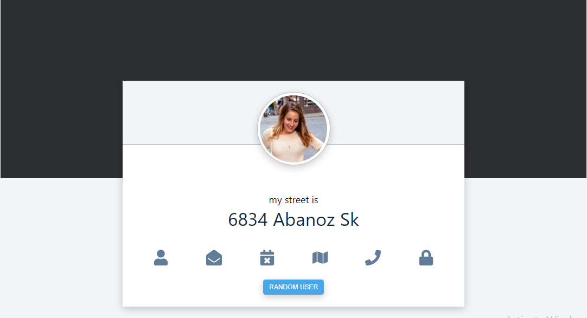
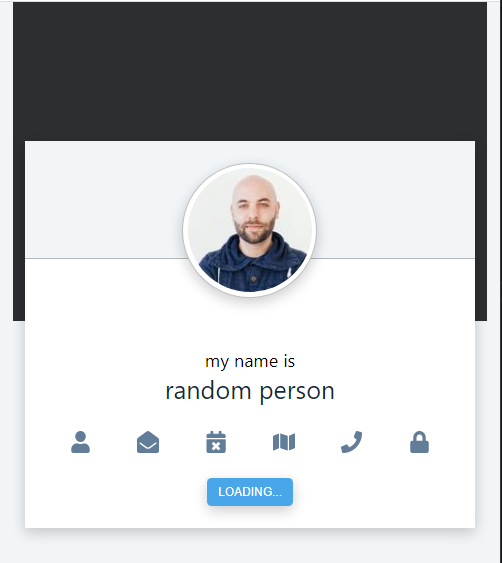

# Random-Person

Completed Another minor react project as i seek to improve my react/javascript
along with vanilla css skills. The Random person project calls access data from an api
https://randomuser.me/api/, the data obtain are then destructure and rendered to  the 
browser as shown in the picture below

# Desktop View 

# Mobile View 

